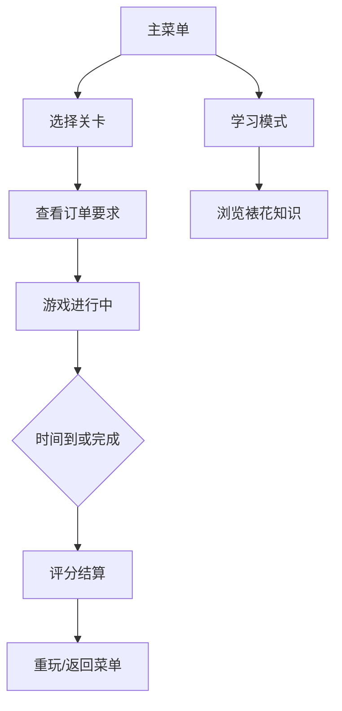

## 1. 产品概述
甜品店裱花挤酱节奏与造型准确度挑战游戏，玩家扮演甜品师控制裱花嘴完成蛋糕装饰订单。
- 目标用户：休闲游戏爱好者、对烘焙裱花感兴趣的玩家
- 产品价值：寓教于乐，体验裱花工艺的同时学习裱花知识

## 2. 核心特性

### 2.1 功能模块
1. **主菜单**：开始游戏、关卡选择、学习模式、最高分查看
2. **游戏场景**：蛋糕胚、裱花嘴、力度指示器、完成度进度条、倒计时
3. **结算界面**：造型完成度、顾客满意度评分、得分统计
4. **学习模式**：裱花知识展示、各种花嘴造型介绍
5. **关卡系统**：3个难度递进的关卡

### 2.2 页面详情
| 页面名称 | 模块名称 | 功能描述 |
|---------|---------|-----------|
| 主菜单 | 导航区域 | 游戏入口、关卡选择、学习模式、最高分展示 |
| 游戏场景 | 游戏区域 | 蛋糕胚渲染、裱花嘴跟随鼠标、挤酱绘制 |
| 游戏场景 | HUD界面 | 力度指示器、造型完成度、倒计时、订单要求展示 |
| 结算界面 | 评分区域 | 完成度、满意度、得分、星级评价 |
| 学习模式 | 知识展示 | 裱花知识卡片、花嘴介绍、操作技巧 |

## 3. 核心流程
玩家从主菜单选择开始游戏 → 选择关卡难度 → 查看订单要求 → 控制裱花嘴移动并控制挤酱力度完成造型 → 时间结束后展示评分 → 可重玩或返回主菜单。

## 4. 用户界面设计
### 4.1 设计风格
- 主色调：柔和粉色(#FFB6C1)、奶油色(#FFF8E7)、巧克力棕(#8B4513)
- 按钮风格：圆角奶油质感按钮，带轻微阴影和悬停放大效果
- 字体：使用圆润可爱的字体（如 Pacifico 展示字 + Nunito 正文字）
- 布局：卡片式布局，温馨甜品店氛围
- 图标风格：手绘卡通风emoji风格图标

### 4.2 页面设计概览
| 页面名称 | 模块名称 | UI元素 |
|---------|---------|--------|
| 主菜单 | 导航区域 | 大标题、奶油质感按钮、背景甜品装饰图案 |
| 游戏场景 | 游戏区域 | 圆形/方形蛋糕胚、金属质感裱花嘴、糖霜粒子效果 |
| 游戏场景 | HUD界面 | 竖向力度条、进度条、倒计时数字、订单卡片 |
| 结算界面 | 评分区域 | 星级评价、大分数显示、满意度表情、奶油边框卡片 |

### 4.3 响应式
- 桌面端优先，适配1024px以上屏幕
- 游戏画布采用固定尺寸居中显示
- 支持鼠标操作（桌面端）和触摸操作（移动端可选）
