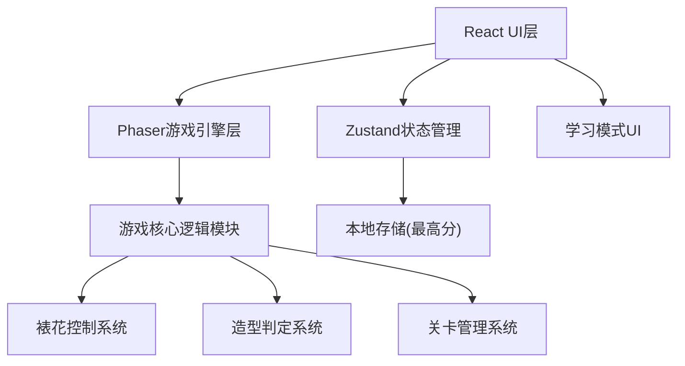

## 1. 架构设计


## 2. 技术说明
- 前端框架：React@18 + TypeScript + Vite
- 游戏引擎：Phaser@3
- 状态管理：zustand
- 样式方案：tailwindcss@3
- 数据持久化：localStorage（本地最高分记录）
- 初始化工具：vite-init

## 3. 路由定义
| 路由 | 用途 |
|-----|------|
| / | 主菜单页面 |
| /game/:level | 游戏场景页面 |
| /learn | 裱花知识学习模式 |

## 4. 数据模型
### 4.1 关卡数据结构
```typescript
interface Level {
  id: number;
  name: string;
  difficulty: 'easy' | 'medium' | 'hard';
  timeLimit: number;
  cakeShape: 'circle' | 'square' | 'heart';
  requiredPatterns: Pattern[];
  nozzleType: 'round' | 'star' | 'leaf' | 'writing';
  targetScore: number;
}

interface Pattern {
  type: 'rose' | 'leaf' | 'shell' | 'text';
  points: { x: number; y: number }[];
  requiredThickness: number;
}
```

### 4.2 游戏状态
```typescript
interface GameState {
  currentLevel: number | null;
  score: number;
  completion: number;
  satisfaction: number;
  timeRemaining: number;
  isPlaying: boolean;
  highScores: Record<number, number>;
}
```

## 5. 核心模块
- **裱花控制模块**：处理鼠标/触摸输入，计算移动速度和挤酱压力
- **挤酱物理模块**：根据速度和压力计算糖霜粗细，处理断裂和堆积
- **造型判定模块**：对比玩家绘制路径与目标路径，计算完成度评分
- **关卡管理模块**：加载关卡配置，管理难度递进
- **存储模块**：localStorage读写最高分
